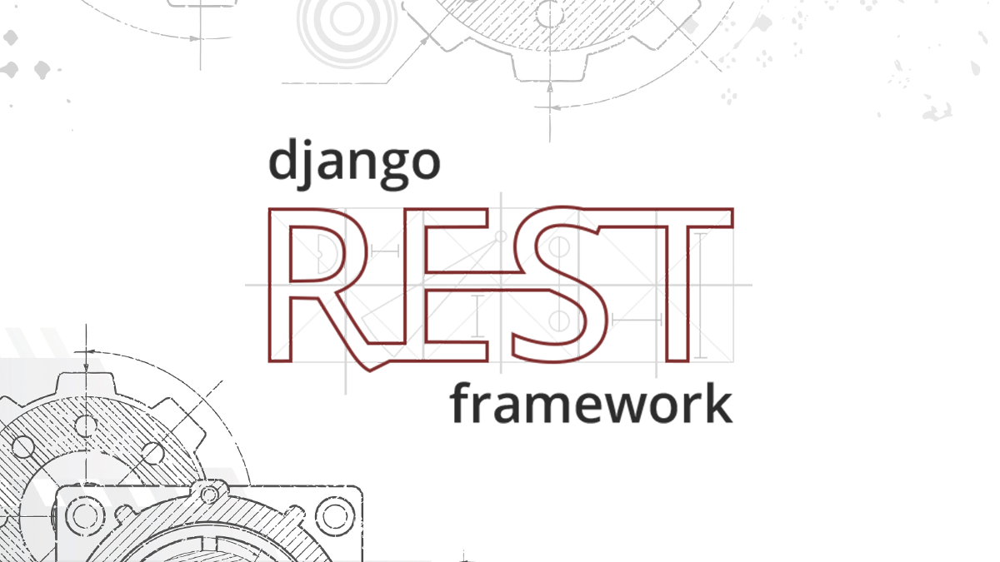

# REST API Boilerplate Setup Guide



This guide provides step-by-step instructions for setting up and running the Django REST Framework API boilerplate project.

## Prerequisites

*   Python 3.8 or higher
*   Pip (Python package manager)
*   Virtual environment management with `venv` (included with Python)

## Setup Steps

1.  **Clone the Repository (If Needed):**
    If you're obtaining the project from a version control system (e.g., Git), first clone the project files to your computer. If you already have the project files, you can skip this step.
    ```bash
    git clone <repository_url>
    cd <project_folder>
    ```

2.  **Create and Activate Virtual Environment:**
    It's recommended to create a virtual environment to isolate project dependencies from other Python projects on your system. Run the following commands from the project root:

    *   Create virtual environment (if `venv` folder doesn't exist):
        ```bash
        python -m venv venv
        ```
    *   Activate virtual environment:
        *   Windows (PowerShell or CMD):
            ```bash
            .\venv\Scripts\activate
            ```
        *   Linux / macOS:
            ```bash
            source venv/bin/activate
            ```
    When the virtual environment is active, you should see `(venv)` at the beginning of your command prompt.

3.  **Install Required Packages:**
    Install the Python packages required for the project using `pip`:
    ```bash
    pip install -r requirements.txt
    ```
    If you want to use PostgreSQL instead of SQLite (current setup uses SQLite):
    ```bash
    pip install psycopg2-binary  # Or psycopg2, depending on your system and PostgreSQL installation
    ```
    If you encounter issues installing `psycopg2`, ensure that PostgreSQL development headers and a C compiler are installed on your system.

4.  **Apply Database Migrations:**
    Create and apply migrations to reflect model changes in the database:
    ```bash
    python manage.py makemigrations api
    python manage.py migrate
    ```

## Running the Development Server

After completing all setup steps, you can start the Django development server:

```bash
python manage.py runserver
```

Keep the terminal window open after running this command. The server will start running at `http://127.0.0.1:8000/` by default.

## API Access and Documentation

*   **Main API Endpoints:**
    *   Teachers: `http://127.0.0.1:8000/api/teachers/`
    *   Students: `http://127.0.0.1:8000/api/students/`

*   **Swagger UI (API Documentation and Testing Interface):**
    `http://127.0.0.1:8000/swagger/`

*   **ReDoc (Alternative API Documentation):**
    `http://127.0.0.1:8000/redoc/`

## Deactivating Virtual Environment

When you're done working on the project, you can deactivate the virtual environment by typing the following command in the terminal:

```bash
deactivate
```

This command works when `venv` is active.

## Customizing the Boilerplate

This project serves as a starting point for your own API development. To customize it:

1. Modify the models in `api/models.py` to suit your data structure
2. Update serializers in `api/serializers.py` accordingly
3. Adjust viewsets in `api/views.py` to implement your business logic
4. Update API endpoints in `api/urls.py` if needed
5. Configure additional settings in `school_project/settings.py`

After making model changes, remember to create and apply migrations:
```bash
python manage.py makemigrations
python manage.py migrate
``` 